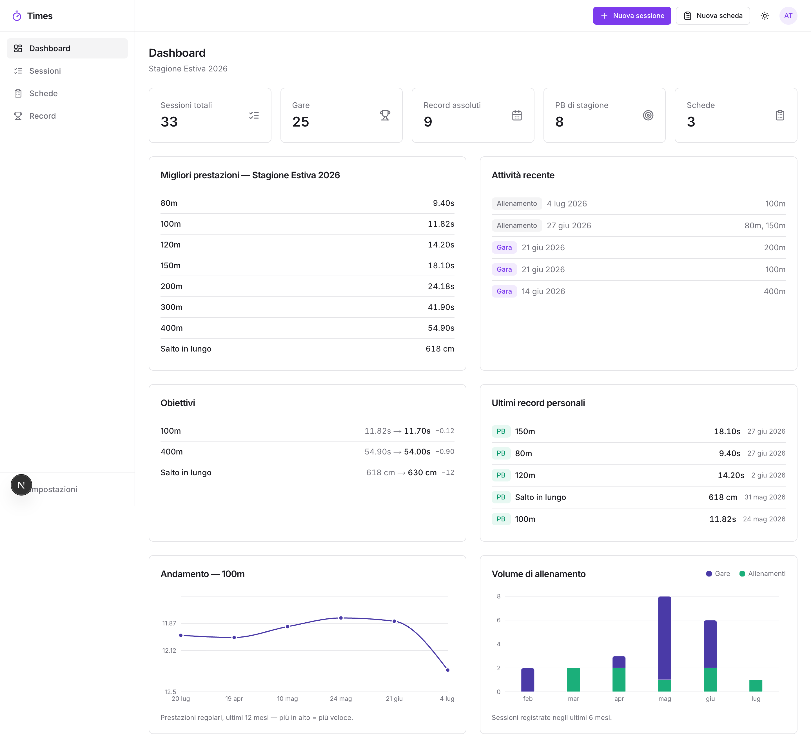
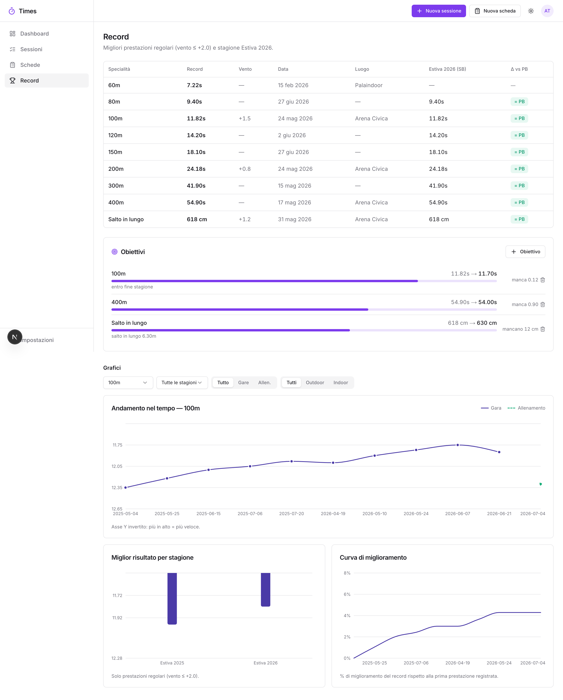
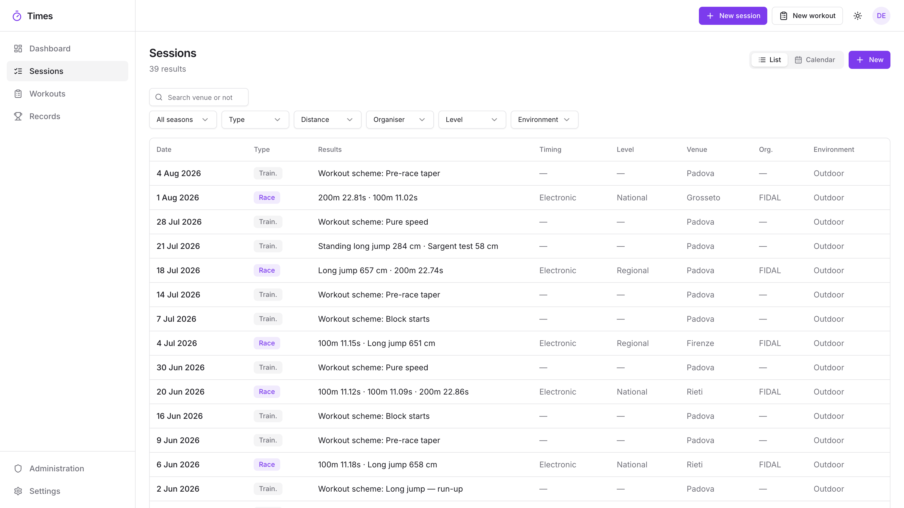
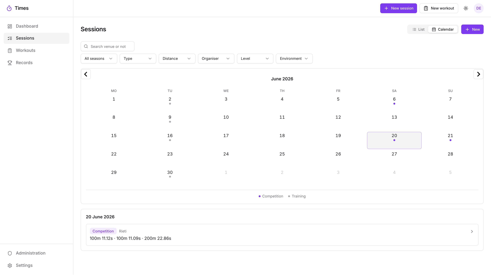
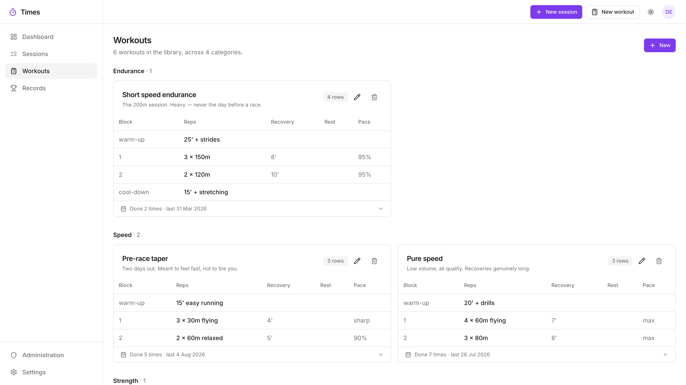

# Times

[](https://github.com/mmattia09/times/actions/workflows/ci.yaml)
[](https://github.com/mmattia09/times/actions/workflows/docker-image.yaml)
[](LICENSE)

A self-hosted web app for track & field athletes: log training sessions and
competitions, track personal and season bests, set goals, keep a library of
structured workouts, and visualise your progress — all on your own server.

Built by a sprinter to replace a Notion database; useful for any athletics
discipline. The interface speaks Italian, English, German and Spanish, installs
on a phone as a PWA, and works the same in any time zone.

## Features

- **Sessions & performances** — a training day or a competition, with any number of
  results (e.g. 100m heat + 200m final) — or **none at all**: a session can just record
  the day (or a multi-day period) you trained, optionally with a workout attached.
  Filters by season, type, discipline, level, organiser and indoor/outdoor, plus a
  free-text search over venue and notes.
- **List or calendar** — the same sessions laid out by day, one month at a time, with
  races and training as separate markers and multi-day meets spanning their days.
- **Links on a session** — the Strava activity, the race video, the start list. Strava,
  Instagram, YouTube and TikTok are recognised and drawn with their own mark in the
  app's own colours.
- **Personal & season bests** — recomputed on every write. Wind-aware: a tailwind above
  **+2.0 m/s** flags the mark *ventosa* (kept and charted, but never a record — the
  [FIDAL](https://www.fidal.it) / World Athletics rule).
- **All disciplines first-class** — sprints, hurdles, middle/long distance, relays, race
  walking, jumps, throws and combined events, each with the right units and
  "lower/higher is better" direction.
- **Athletic tests** — standing jumps (lungo/alto/triplo/quintuplo/decuplo da fermo) and
  the Sargent test live in their own **Test** discipline, so they never mix into the
  competition-jump records.
- **Charts** — progress over time, best per season, improvement curve, training volume;
  theme-aware and colour-blind-safe.
- **Goals** — set a target per event and watch the gap to your PB close.
- **Workout library** — structured schemes in the classic coach-table format
  (block · reps · recovery · pause · pace · notes), attachable to sessions as immutable
  snapshots. Each workout shows how many times you have done it and links to those
  sessions (and back).
- **Two seasons per year** — *estiva* (Apr–Sep) and *invernale* (Oct–Mar).
- **FIDAL import** — paste your athlete profile URL and import official results,
  de-duplicated.
- **Full JSON import/export** — migrating instance is *export → register → import*.
- **REST API** — `/api/v1/*` with per-user API keys.
- **Multi-user** — isolated accounts; nobody can see anyone else's training.
- **Admin area** — the owner (and anyone they promote) gets a page listing every user
  with what they have logged and whether they are still signed in, plus the controls to
  create an account, grant or revoke admin, sign someone out of every device, and
  delete a user with all their data.
- **Four languages** — Italian, English, German and Spanish, picked per user in
  Settings (or guessed from the browser on first visit). Event names, seasons and
  dates all follow the choice.
- **Time-zone safe** — a session date is a calendar day: the 24th of May stays the
  24th whether the server runs in Rome, London or UTC. Timestamps (last sync, API-key
  activity) render in your own zone, taken from the browser or set in Settings.
- **Installable (PWA)** — add it to the home screen and log times at the track. With no
  signal the logging page still opens; sessions you write, and changes you make to ones
  already there, are kept on the phone and sent by themselves when the network returns.
- **Repeat a session** — reopen a past session with its venue, timing, level and
  workout, dated today and with the results blank, ready to fill in.

## Visuals

**Dashboard** — season overview, goals, latest PBs, progress of your most-raced event
and monthly training volume.



**Records** — personal & season bests (wind-legal), goals, and per-event charts.



<details>
<summary>More screenshots — sessions, calendar & workout library</summary>

**Sessions** — every training day and competition, filterable and searchable.



**Calendar** — the same sessions by month; pick a day to see what was on it.



**Workouts** — the library, in the coach-table format.



</details>

> The screenshots use an invented athlete, generated by
> [`scripts/demo-data.ts`](apps/web/scripts/demo-data.ts) — no real training data.

## How it works

Two containers on a private Docker network: a Next.js app and a Postgres
database. No cache, no queue, no object store, no external service — the app
keeps the little state that isn't yours (rate-limit windows, a cached lookup or
two) in its own memory. The app image is prebuilt; on boot it migrates the
database and provisions the admin account from the environment.

The data model is small on purpose:

- a **session** is a day (or a period) you trained or competed;
- it holds any number of **performances** — a discipline, a distance or event, a
  mark, and optionally wind, lane, place and heat;
- **personal and season bests** are not stored by hand: they are recomputed from
  the performances after every write, which is why they can never drift out of
  step with the log;
- a **workout** attached to a session is a snapshot, so editing the library never
  rewrites what you actually did that day.

Two decisions explain most of the behaviour that might otherwise surprise you.
A mark with a tailwind above **+2.0 m/s** is kept and charted but never becomes a
record, because that is the rule it would be judged by. And a session date is a
**calendar day, not an instant**: the 24th of May is the 24th whether the server
runs in Rome or UTC, while timestamps like "last sync" are shown in your own
zone.

## Installation

### Requirements

- [Docker](https://docs.docker.com/get-docker/) with Compose (that's all — the app image
  is prebuilt by GitHub Actions and published to GHCR).
- For local development only: Node 22+, pnpm 11.

### Run it

```bash
git clone https://github.com/mmattia09/times.git && cd times
cp .env.example .env
# Edit .env — at minimum:
#   BETTER_AUTH_SECRET  → openssl rand -base64 32
#   ADMIN_EMAIL / ADMIN_PASSWORD → your admin login
docker compose up -d
```

On boot the app container runs the database migrations and provisions the admin
account, then serves at <http://localhost:3000>. Change the host port with
`APP_PORT` in `.env`. Everything runs on an isolated `times` Docker network and
Postgres is not exposed to the host at all — uncomment its `ports` in
`docker-compose.yaml` only if you want to reach it with `psql`.

To update: `docker compose pull app && docker compose up -d`. To pin a version,
set `APP_IMAGE=ghcr.io/mmattia09/times:1.7.0` in `.env` — image tags carry no
leading `v`, and `:1.7` follows the patches of a minor release.

### Configuration

| Variable               | Purpose                                                          |
| ---------------------- | ---------------------------------------------------------------- |
| `DB_PASSWORD`          | Password for the Postgres container.                             |
| `DATABASE_URL`         | Postgres connection string (used by local dev).                  |
| `BETTER_AUTH_SECRET`   | Session-signing secret (`openssl rand -base64 32`).              |
| `BETTER_AUTH_URL`      | Public URL where the app is reachable (see *Behind a proxy*).    |
| `TRUSTED_ORIGINS`      | Extra public names the same instance answers to, comma separated.|
| `SECURE_COOKIES`       | `false` when the app is also opened over plain http on the LAN.  |
| `ADMIN_EMAIL`          | Admin login email.                                               |
| `ADMIN_PASSWORD`       | Admin login password.                                            |
| `DISABLE_REGISTRATION` | `true` to block new sign-ups once your accounts exist.           |
| `UPDATE_CHECKS`        | `false` to stop the server asking GitHub for newer releases.      |
| `BACKUP_SCHEDULE`      | `off` (default), `daily`, `weekly`, `biweekly`, `monthly`, `bimonthly`, `quarterly`, `yearly`. |
| `BACKUP_PATH`          | Optional: host directory for backups instead of a Docker volume.  |
| `APP_PORT`             | Optional: host port to serve on (default `3000`).                |
| `APP_IMAGE`            | Optional: pin the image version to run.                          |

The version card in Settings — admins only — says which release the instance is
running and shows the release notes for anything newer. The server asks GitHub's
public release list at most once every six hours; nothing about you or your
training is sent, and `UPDATE_CHECKS=false` stops it asking at all.

**Accounts.** The *owner* is the first user, provisioned from `ADMIN_EMAIL` /
`ADMIN_PASSWORD`: edit `.env` and restart to change its credentials (they re-sync on
every boot; the display name is editable in the app). Because the environment owns that
account, the admin area refuses to demote or delete it.

The owner can grant **admin** to anyone else from **Administration**, which is also
where accounts get created when `DISABLE_REGISTRATION=true` leaves no other way in —
there is no mail server, so the admin sets an initial password and passes it on. That
password can be marked as temporary: until the person replaces it, neither the app nor
the API opens for them. Admins can also reset an existing user's password, on the same
terms — it signs that user out everywhere, and the dialog says plainly that the
password opens their account until they change it.

Everyone else registers through the UI and self-manages name, email, password,
language and time zone from **Settings**.

### Behind a proxy or a tunnel

Set `BETTER_AUTH_URL` to the address you actually type in the browser — a
Cloudflare tunnel hostname, or whatever your reverse proxy serves. Logins are
refused from any origin the app doesn't recognise, which is what stops another
site from driving your session, so this has to be right.

Two things follow from that:

- **Reaching it by LAN address as well.** Private addresses — `192.168.x`,
  `10.x`, `172.16–31.x`, `*.local`, `localhost` — are always accepted, so
  logging in at `http://192.168.1.40:3000` needs no configuration. A second
  *public* name does: list it in `TRUSTED_ORIGINS`.
- **Cookies over plain http.** A session cookie is marked `Secure` when
  `BETTER_AUTH_URL` is https, and browsers drop `Secure` cookies on an http
  page — so the LAN login would appear to succeed and leave you signed out.
  Set `SECURE_COOKIES=false` when you use both. It is the one trade-off here:
  the cookie is then no longer https-only.

The app prints its effective configuration on the first request, so
`docker compose logs app | grep boot` tells you what it thinks it is.

### Logs

Every login, sign-up, password change, and every record the app writes appears
on stdout as one line, with a timestamp and key=value fields:

```
2026-07-31T19:30:51.523Z  auth.signin  user=ma***@example.com  ip=203.0.113.9  origin=https://times.example.com  status=200
2026-07-31T19:31:37.882Z  session.created  user=lWC6l…  id=nTSdA…  date=2026-07-30  type=training  results=1
2026-07-31T19:31:06.638Z  auth.origin.rejected  origin=https://elsewhere.example  trusted=https://times.example.com  hint=…
```

Emails are masked and passwords and tokens are never logged. Follow along with
`docker compose logs -f app`, or pick out one kind with
`docker compose logs app | grep auth.signin`.

The first line at startup says how the instance is configured — which public URL
it answers to, whether cookies are marked Secure, whether backups are on. It is
the quickest answer to "why won't it let me log in".

### Backups

Off unless you ask for them. Pick an interval and they happen:

```bash
BACKUP_SCHEDULE=weekly
```

Anything from `daily`, `weekly`, `biweekly`, `monthly`, `bimonthly`,
`quarterly`, `yearly` — or `off`, which is also what an unset variable means. An
interval is a number of days, so `monthly` is every 30 days rather than a
calendar month.

A run writes one file per user, in the same JSON format as **Settings → Export**.
The files land in a dated folder on a volume of their own, with a manifest saying
which file belongs to which account:

```
/backups/2026-08-11/manifest.json
/backups/2026-08-11/<user-id>.json
```

#### Restoring

One account, by the person who owns it: **Settings → Import**, on their file.

The whole instance, including accounts that no longer exist:

```bash
docker compose exec app node restore.cjs 2026-08-11   # a folder
docker compose exec app node restore.cjs              # the newest one
docker compose exec app node restore.cjs --dry-run    # say what it would do
```

It matches each file to an account by email, falling back to the id in the file
name, and creates the accounts that aren't there — with their name and their
admin flag, but no password, since a backup deliberately contains no
credentials. Those accounts are flagged as needing a password: set one from the
admin area and their data is already waiting. A file that can't be attributed to
anyone is skipped rather than guessed at.

Restoring only ever adds. Sessions are deduplicated by content, so running it
twice changes nothing the second time and restoring onto an instance that has
moved on merges rather than overwrites — nothing already there is deleted.

A restore is a command rather than a button on purpose: it has to work on the
day nobody can sign in, and letting a browser session restore every account is
not a power a web page should have.

By default that volume is a Docker one named `backups`. To put the files on a
disk you already back up elsewhere, point `BACKUP_PATH` at a host directory:

```bash
BACKUP_PATH=/mnt/nas/times-backups
```

The app runs as a non-root user, so a host directory has to be writable by
uid 1001 (`chown 1001:1001 /mnt/nas/times-backups`). If it isn't, the log says
so and the app carries on serving — a backup that can't be written never stops
anyone logging a session.

Nothing is ever deleted, so an old backup is only removed when you remove it.
The interval is measured from the newest folder present, which means a restart
neither forgets the last run nor repeats it, and a run that fails is retried at
the next check rather than counting as done.

## Usage

1. Log in with the admin credentials, pick your language in *Settings → Language*, and
   set your **FIDAL profile URL** under *Settings → FIDAL integration* to pull in your
   official results — or start logging by hand with **New session**.
2. Build your workout library under **Workouts** and attach one when logging a training
   session. Repeating a day you have already logged: open it and press **Repeat**.
3. **Records** shows PBs, season bests and charts; set targets with **Goals**.
4. Your data is yours: *Settings → Data* exports everything as one JSON file, and the
   import is idempotent (re-importing never duplicates).

Programmatic access — generate a key in *Settings → API keys*:

```bash
curl -H "Authorization: Bearer ath_live_…" https://your-host/api/v1/records
```

| Method & path                     | Description                              |
| --------------------------------- | ---------------------------------------- |
| `GET/POST /api/v1/sessions`       | List / create sessions (`performances` may be empty) |
| `GET/PUT/DELETE /api/v1/sessions/:id` | Read / replace / delete a session    |
| `GET /api/v1/performances`        | List performances (`distance,from,to`)   |
| `GET /api/v1/records`             | Personal bests per event                 |
| `GET /api/v1/export` · `POST /api/v1/import` | Full backup / restore         |
| `GET /api/v1/fidal/preview` · `POST /api/v1/fidal/sync` | FIDAL import      |

A rejected write answers `400 {"error":"bad_request","issues":…}`, where each issue is
a stable key such as `validation.dateRequired` — the same key the UI translates, so the
message never changes with the caller's language.

## Contributing

Questions, bug reports and pull requests are welcome —
[open an issue](https://github.com/mmattia09/times/issues). To get a dev
environment running:

```bash
pnpm install
docker compose up -d db            # Postgres only — uncomment its ports first
cp .env.example apps/web/.env.local
pnpm db:migrate && pnpm db:seed    # migrations + admin provisioning
pnpm dev                           # http://localhost:3000
```

Before opening a PR, please make sure these pass (CI runs the same checks):

```bash
pnpm --filter web lint
pnpm --filter web exec tsc --noEmit
pnpm --filter web check    # the rules worth pinning down — see apps/web/scripts
pnpm --filter web build
```

Schema changes go through Drizzle migrations (`pnpm db:generate`), committed with the
change. UI text goes through the dictionaries in `apps/web/lib/i18n/locales`: add the
key to `it.ts` first — it is the source of truth the others are typed against, so a
missing translation is a compile error, not a surprise at runtime.

## Authors and acknowledgment

Made by [@mmattia09](https://github.com/mmattia09). Developed with the help of
[Claude Code](https://claude.com/claude-code).

## License

[MIT](LICENSE).
